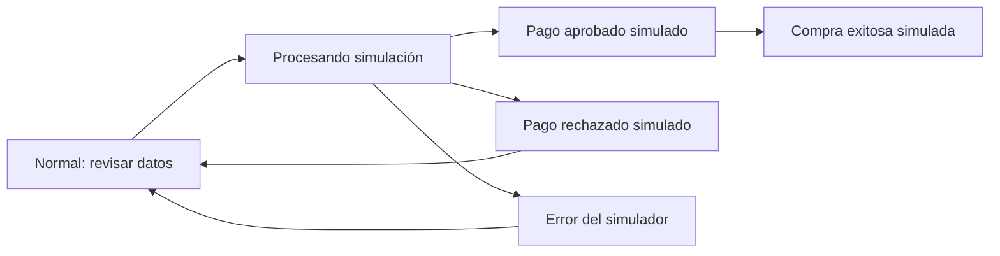
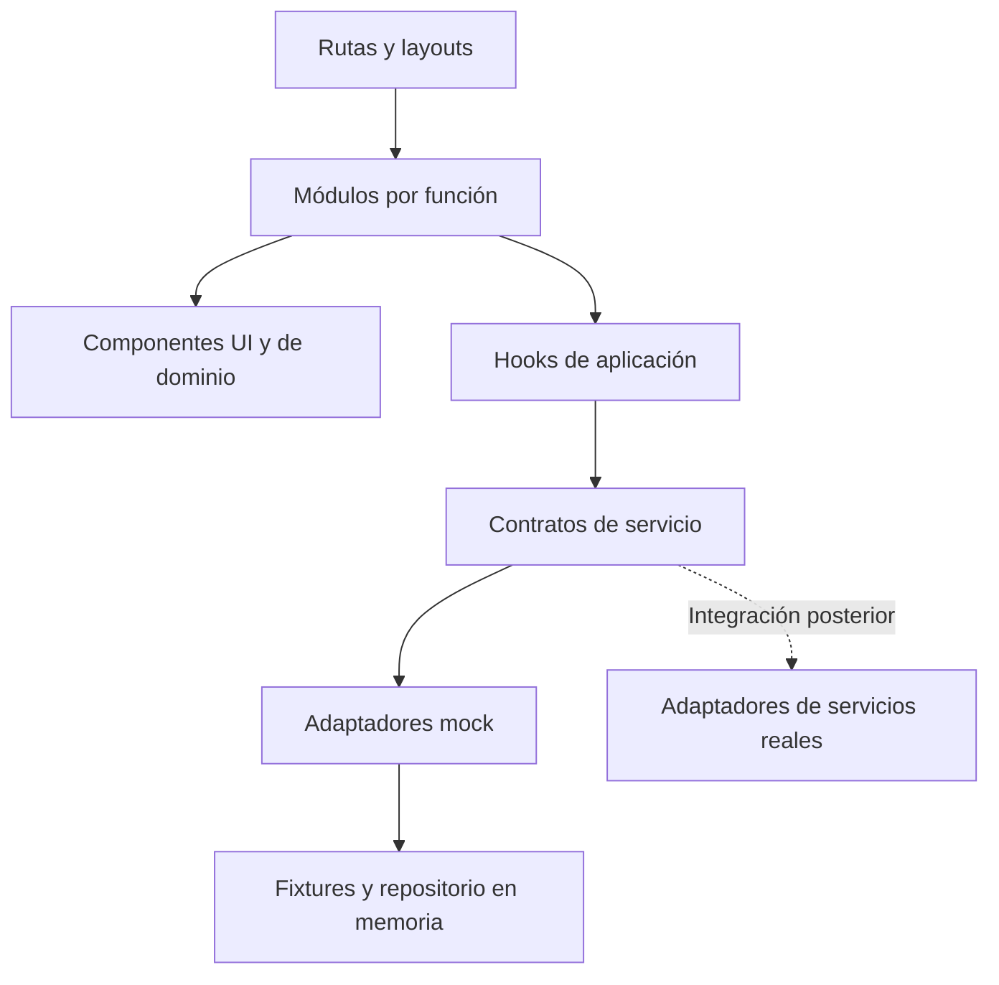

# Aroma Infini — Plan de diseño frontend

**Revisión de experiencia vigente:** [HOME_EXPERIENCE_REVIEW.md](HOME_EXPERIENCE_REVIEW.md) documenta la síntesis actual de las seis referencias, el índice fotográfico de firmas, el nuevo encuentro editorial y la validación del recorrido completo del Home.

**Última iteración:** [HOME_REFINEMENT_REVIEW.md](HOME_REFINEMENT_REVIEW.md) actualiza el hero a tres campañas cada tres segundos sin controles habituales visibles, unifica marcas, devuelve el bloque editorial a una marca destacada y compacta el cierre. Prevalece sobre las decisiones visuales anteriores; no amplía la fase comercial.

**Revisión vigente:** [HOME_PREMIUM_REVIEW.md](HOME_PREMIUM_REVIEW.md) documenta marcas, fotografía editorial, destacados, hero automático y navbar con tres grupos. Conserva las correcciones de ritmo, precios, favoritos locales y accesibilidad de [HOME_FRONTEND_AUDIT.md](HOME_FRONTEND_AUDIT.md). No amplía el alcance a la siguiente fase comercial.

Fecha: 12 de septiembre de 2026. Versión: 1.0. **Base aprobada explícitamente por el cliente para implementar solo las fases 1 y 2. Las decisiones PROPUESTA TEMPORAL siguen sujetas a revisión visual.**

Este plan desarrolla la [auditoría de las seis referencias](REFERENCE_AUDIT.md). Define el futuro frontend comercial con datos simulados. Su redacción inicial correspondió exclusivamente a la fase documental. La aprobación posterior autoriza la base mínima, header, navegación y Home; no autoriza avanzar a la fase 3. La arquitectura futura no obliga a crear archivos anticipadamente: prevalece YAGNI. Véase la [entrega de fases 1 y 2](PHASE_1_2_DELIVERY.md).

**Lectura de estados:** CONFIRMADO corresponde al pedido del cliente; PROPUESTA TEMPORAL identifica una solución para evaluar; PENDIENTE identifica información o decisiones que todavía faltan. «PENDIENTE DE VALIDACIÓN» se registra como PENDIENTE en la tabla final. Todo detalle de diseño, contenido o implementación no confirmado expresamente es una propuesta, aunque no se repita la etiqueta en cada oración.

**Revisión visual de Fase 2 — 13/09/2026:** por instrucción posterior del cliente, se sustituye la propuesta inicial de hero dividido y header blanco en portada por fotografía inmersiva con texto integrado, carrusel manual con fundido y navegación transparente que pasa a blanco al desplazarse. Esta autorización es exclusivamente visual; véase [la revisión implementada](PHASE_2_VISUAL_REVIEW.md). No autoriza la Fase 3.

**Segunda revisión de Home — 13/09/2026:** el cliente confirma la dirección actual del hero y navbar y autoriza una mejora exclusivamente visual desde su transición hacia abajo. Marcas, categorías, productos y ritmo editorial se detallan en [HOME_EDITORIAL_REVIEW.md](HOME_EDITORIAL_REVIEW.md). Esta iteración queda pendiente de aprobación visual y no amplía el alcance funcional.

**Ampliación posterior del navbar — 13/09/2026:** el cliente solicita acceso a todos los apartados públicos desde la navegación superior. Se amplía el header con desplegables Perfumes, Marcas, Descubrir y Ayuda, conservando la dirección visual aprobada y los destinos informativos existentes. Véase [NAVIGATION_REVIEW.md](NAVIGATION_REVIEW.md). Esta autorización corresponde a navegación; no a la implementación de nuevas pantallas comerciales.

**Revisión premium posterior — 13/09/2026:** la petición más reciente autoriza expresamente cambio automático suave del hero y simplificar la navegación. Se implementan rotación cada siete segundos con pausa accesible, tres grupos de navbar y mejoras de marcas, Cuaderno de aromas y destacados; categorías y Más vendidos conservan su composición aprobada. Véase [HOME_PREMIUM_REVIEW.md](HOME_PREMIUM_REVIEW.md). Esta decisión actualiza la condición manual de las revisiones anteriores; no amplía el alcance comercial.

**Skills leídas y aplicadas antes de planificar:**

| Skill                                                                                                     | Aplicación en este plan                                                                                       |
| --------------------------------------------------------------------------------------------------------- | ------------------------------------------------------------------------------------------------------------- |
| [frontend-design](../.agents/skills/frontend-design/SKILL.md)                                             | Dirección original, composición editorial, tokens, un rasgo visual reconocible y diseño móvil desde el inicio |
| [frontend-react-best-practices](../.agents/skills/frontend-react-best-practices/SKILL.md)                 | Composición por funciones, estado localizado, carga por ruta y persistencia mínima                            |
| [typescript-react-patterns](../.agents/skills/typescript-react-patterns/SKILL.md)                         | Modelos de dominio, props explícitas, contextos tipados y estados mutuamente excluyentes                      |
| [frontend-accessibility-best-practices](../.agents/skills/frontend-accessibility-best-practices/SKILL.md) | Semántica, teclado, foco, formularios, anuncios de estado y objetivos táctiles                                |

También se leyeron las referencias de tokens y antipatrones de frontend-design. Se mantiene **React + TypeScript + Vite + Tailwind CSS**, según el cliente, por encima de la preferencia de la skill por Next.js. La apariencia clara confirmada prevalece sobre su guía general de modo oscuro: no se propone un selector de tema. No se aplican patrones de Server Components o hidratación a esta SPA. El pedido ya aporta las restricciones que necesita la skill de diseño; no hace falta volver a preguntarlas.

## 1. Resumen de Aroma Infini

E-commerce premium de perfumes para Perú, dirigido a hombres y mujeres, con una identidad exclusiva, moderna y minimalista. Su concepto confirmado es **«Confianza y variedad»**; debe transmitir confianza, exclusividad y novedad.

La siguiente etapa, después de aprobar este documento, construirá una propuesta visual navegable y funcional con mocks. Su arquitectura debe permitir convertirla en el frontend definitivo. Esta etapa no incluye Supabase, PostgreSQL, autenticación real, R2, pasarelas, API, Workers de backend, Edge Functions, webhooks, stock real, correos, transferencias, vouchers, facturación electrónica ni SUNAT. Tampoco instala anticipadamente sus SDK.

El workspace revisado contiene las skills y su archivo de registro; no hay una aplicación existente que conservar o migrar. La estructura descrita aquí todavía no se crea.

## 2. Objetivos visuales

- **Confianza:** precios y presentaciones legibles, estados inequívocos, condiciones de entrega claras y contenido verificable.
- **Exclusividad:** fotografía cuidada, composición con aire y pocas decisiones visuales consistentes.
- **Variedad:** rutas evidentes por marcas y género; categorías comprensibles sin conocimiento previo de perfumería.
- **Novedad:** espacio para nuevos productos y selecciones que el negocio pueda renovar.
- **Conversión como hipótesis a validar:** que una persona encuentre un perfume, compare tamaños y complete la compra simulada sin necesitar explicación externa.

No se promete un aumento de conversión sin pruebas. En la revisión se evaluará si el comprador identifica marca, precio, disponibilidad y siguiente acción; y si una persona no técnica puede modificar un destacado desde el panel.

## 3. Público objetivo

**CONFIRMADO:** hombres y mujeres de NSE B y B+. No se inventan edad, nivel de experiencia, ticket promedio ni hábitos digitales.

**Hipótesis de uso:** coexistirán quien busca un perfume concreto, quien reconoce una marca y quien explora por género/precio. El buscador atiende al primero; marcas al segundo; catálogo y perfil olfativo al tercero. Se probarán esos recorridos antes de añadir segmentaciones nuevas.

## 4. Principios de UX

1. Presentar las decisiones de compra en su contexto: ml, precio y disponibilidad juntos.
2. Facilitar Marca → Género → Precio → Ocasión como orientación, sin obligar a un embudo. Ocasión empieza como contenido orientador, no como cuarto filtro.
3. Un CTA principal por bloque o paso; enlaces secundarios claramente diferenciados.
4. Mantener búsqueda, filtros y retorno al catálogo predecibles; conservar selección y posición al volver de una ficha.
5. Mostrar errores corregibles junto al control correspondiente y preservar datos ya introducidos.
6. Evitar urgencia inventada, reviews falsas, descuentos ambiguos y suscripción obligatoria.
7. Diseñar agotados, vacíos y fallos como parte del flujo habitual.
8. Ofrecer las mismas funciones esenciales con teclado, táctil y ratón.

## 5. Síntesis de referencias

La evidencia detallada y los límites están en [REFERENCE_AUDIT.md](REFERENCE_AUDIT.md). Las siguientes aplicaciones son inferencias de diseño, no resultados demostrados de conversión.

| Referencia                                                         | Aprendizaje que se transforma                                                                  |
| ------------------------------------------------------------------ | ---------------------------------------------------------------------------------------------- |
| [Jovoy](https://www.jovoyparis.com/en/)                            | Conectar exploración multimarca e información olfativa                                         |
| [Aedes](https://www.aedes.com/)                                    | Directorio de marcas y un espacio editorial para descubrirlas                                  |
| [D.S. & Durga](https://www.dsanddurga.com/collections/perfume-all) | Hacer comprensible la relación entre presentación y precio                                     |
| [Vilhelm](https://vilhelmparfumerie.com/)                          | Consistencia fotográfica y encuadres específicos para móvil                                    |
| [Twisted Lily](https://twistedlily.com/collections/fragrance)      | Filtros, favoritos y disponibilidad dentro del recorrido de compra                             |
| [Phlur](https://phlur.com/)                                        | Sugerencias de búsqueda y continuidad hacia otros perfumes; solo estructura textual verificada |

No se trasladan sus paletas, frases, logos, imágenes, servicios de muestras, membresías ni reglas comerciales.

## 6. Dirección visual propuesta

**PROPUESTA TEMPORAL: perfumería editorial blanca.** La interfaz ofrece un fondo constante y una retícula limpia para que el surtido tenga personalidad sin competir con la marca de la tienda.

El rasgo propio será una **franja editorial de lectura**: título corto y descriptor alineados con el borde de una fotografía, con un separador fino cuando haga falta. Se repetirá de forma contenida en hero, editorial de marca y perfil olfativo. No es un eslogan ni un logotipo.

En móvil, imagen, título y acción forman una secuencia vertical. En escritorio, el hero puede disponer imagen y texto en proporción aproximada 60/40; las secciones de producto recuperan una retícula regular. El ritmo alterna imagen amplia, selección de producto y pausa de lectura. Las tarjetas de catálogo no usan contenedores elevados.

El nombre «Aroma Infini» se presentará inicialmente como texto tipográfico accesible; no se diseña un logo definitivo. La marca no dependerá de un color de frasco ni de una campaña concreta.

## 7. Paleta provisional

**CONFIRMADO:** blanco predominante, apariencia clara, limpia y pulcra. **PENDIENTE:** logo y acento definitivo.

| Token semántico propuesto | Valor provisional    | Uso                                                             |
| ------------------------- | -------------------- | --------------------------------------------------------------- |
| `color.background`        | `#FFFFFF`            | Fondo principal                                                 |
| `color.surface`           | `#F6F6F4`            | Soportes puntuales de producto y secciones auxiliares           |
| `color.ink`               | `#202020`            | Texto principal                                                 |
| `color.textSecondary`     | `#5C5C5C`            | Información secundaria legible                                  |
| `color.borderSubtle`      | `#DEDEDA`            | Separadores decorativos                                         |
| `color.controlBorder`     | `#767676`            | Límites de inputs y controles que deben reconocerse             |
| `color.accent`            | Alias de `color.ink` | CTA y estado seleccionado; sin añadir todavía un matiz de marca |
| `color.onAccent`          | `#FFFFFF`            | Texto sobre CTA                                                 |
| `color.focus`             | `#202020`            | Anillo de foco con separación blanca                            |
| `color.error`             | `#A12C2C`            | Error más texto e icono                                         |
| `color.success`           | `#286044`            | Confirmación más texto e icono                                  |
| `color.warning`           | `#76530D`            | Advertencia operativa más texto e icono                         |

Los colores de estado son funcionales, no una paleta secundaria de marca. El borde sutil no servirá como único límite de un control. Se comprobará el contraste de cada pareja real, incluyendo texto sobre imagen y estados disabled; los valores son candidatos, no una auditoría ya aprobada.

Los componentes consumirán tokens semánticos centralizados. El acento se podrá sustituir sin buscar colores escritos en cada componente. El mapeo a utilidades de Tailwind se definirá al fijar su versión; su [documentación de variables de tema](https://tailwindcss.com/docs/theme) permite relacionar tema y utilidades. No se crean configuraciones ahora.

## 8. Tipografía propuesta

**PROPUESTA TEMPORAL:** una sola familia, **IBM Plex Sans**, con pesos 400, 500 y 600 y uso moderado de 300 en titulares grandes, sujeto a prueba de legibilidad. Es una opción con estructura recta y contraste suficiente entre texto editorial e interfaz sin incorporar una serif ornamental. El repositorio oficial ofrece la familia bajo OFL y documenta su uso en interfaces y soporte de latín extendido. [Fuente: IBM Plex](https://github.com/IBM/plex).

La sofisticación vendrá de proporción, interlineado y espacio, no de mezclar fuentes. El cliente validará muestras reales de «Aroma Infini», nombres largos, «50 ml», «S/ 450.00» y formularios. Una alternativa de fuente solo se propondrá si esa prueba falla; la familia definitiva sigue pendiente.

| Rol                     | Móvil    | Escritorio | Interlineado / tratamiento                  |
| ----------------------- | -------- | ---------- | ------------------------------------------- |
| Display / hero          | 36–44 px | 56–72 px   | 1.05–1.12; máximo 2–3 líneas                |
| H1 de página            | 30–36 px | 40–48 px   | 1.15                                        |
| H2 de sección           | 26–30 px | 32–40 px   | 1.2                                         |
| H3 / nombre de producto | 16–20 px | 18–24 px   | 1.3–1.4                                     |
| Cuerpo y formularios    | 16 px    | 16 px      | 1.5–1.6                                     |
| Secundario              | 14 px    | 14 px      | 1.45                                        |
| Etiqueta breve          | 12–13 px | 12–13 px   | Nunca para precio, error o acción principal |

Escala fluida entre extremos, sin reducir el texto de entrada en móvil. UI en caja de oración; mayúsculas espaciadas únicamente en rótulos muy cortos si aportan jerarquía. Precios alineados con cifras tabulares donde la fuente lo permita. Fallback: sans del sistema. Fuentes locales WOFF2 y licencia conservada cuando se incorporen assets autorizados.

## 9. Design system inicial

### 9.1 Espacio, ancho y forma

| Grupo                   | Propuesta inicial                                                                           |
| ----------------------- | ------------------------------------------------------------------------------------------- |
| Espaciado               | Base 4 px; escala 4, 8, 12, 16, 24, 32, 48, 64, 96, 128                                     |
| Gutter                  | 16 px en 360–430; 24 en tablet; 32–48 en escritorio                                         |
| Contenedor comercial    | Máximo 1320 px; centrado                                                                    |
| Contenedor editorial    | Hasta 1440 px; imágenes puntuales pueden llegar al borde                                    |
| Lectura                 | Aproximadamente 60–70 caracteres por línea                                                  |
| Formularios             | Columna útil de 560–640 px; resumen aparte cuando haya espacio                              |
| Separación de secciones | 48–64 px móvil; 80–112 px escritorio                                                        |
| Radius                  | 0 px para imágenes/tarjetas; 2–4 px para controles; círculo solo en iconos que lo requieran |
| Bordes                  | 1 px; estados seleccionados de 2 px sin cambiar tamaño externo                              |
| Sombras                 | Ninguna en catálogo; una sombra tenue opcional para overlays                                |
| Capas                   | Contenido, header, ayuda/CTA fijo, overlay y diálogo; un solo modal activo                  |

### 9.2 Primitivas y patrones

| Elemento                 | Aspecto y comportamiento                                                                                                                   |
| ------------------------ | ------------------------------------------------------------------------------------------------------------------------------------------ |
| Button                   | Primario charcoal, secundario con borde, terciario discreto; tamaños y estados normal/hover/focus/disabled/loading; altura principal 48 px |
| Link                     | Navegación real con destino; subrayado perceptible al foco/hover y persistente en texto de lectura                                         |
| IconButton               | Área mínima 44 × 44 px, nombre accesible; dibujo simple coherente                                                                          |
| Field / Input / Textarea | Label visible, ayuda, error asociado; required explícito; el placeholder no sustituye label                                                |
| Select                   | Nativo en la primera implementación salvo necesidad validada; apariencia adaptada a tokens                                                 |
| Checkbox / Radio         | Para filtros, consentimiento si corresponde y variantes; seleccionado por forma/texto además de color                                      |
| Chip                     | Filtro aplicado con acción de quitar nombrada; rectangular y contenido breve                                                               |
| Badge                    | Texto compacto sin iconografía promocional excesiva; prioridad documentada en sección 15                                                   |
| Dialog                   | Título, contenido, cierre visible y ciclo de foco; confirmaciones limitadas a acciones relevantes                                          |
| Drawer                   | Misma base accesible que Dialog cuando bloquea el fondo; carrito, filtros o menú; ancho máximo aproximado 440–480 px en desktop            |
| Toast / InlineStatus     | Mensaje corto en región de estado, sin mover foco; errores que requieren corrección permanecen junto al campo                              |
| ProductCard              | Composición específica de catálogo con fotografía y datos de dominio; no una tarjeta genérica configurable para todo                       |
| SectionHeading           | Título y enlace contextual alineados; separación constante                                                                                 |
| Skeleton                 | Reserva geometría; sin animación cuando el usuario reduce movimiento                                                                       |
| EmptyState / ErrorState  | Explica la situación y ofrece una acción útil; sin ilustraciones decorativas obligatorias                                                  |

La galería y el selector de variantes se compondrán con estas bases. Se validarán los estados de los componentes antes de construir páginas completas. No se elige un kit visual ni se instala una librería de modales o animaciones por defecto.

## 10. Sitemap

**PROPUESTA TEMPORAL de URLs**, excepto `/favoritos` y las rutas administrativas solicitadas. React Router coordinará layouts y navegación; no es necesario introducir otro framework.

| Ruta                                                           | Propósito                                                                |
| -------------------------------------------------------------- | ------------------------------------------------------------------------ |
| `/`                                                            | Home                                                                     |
| `/catalogo`                                                    | Catálogo con estado de filtros/orden/página en URL                       |
| `/marcas`                                                      | Directorio de marcas; índice alfabético si el volumen lo necesita        |
| `/marcas/:slug`                                                | Presentación breve de marca y productos, reutilizando catálogo           |
| `/mas-vendidos`                                                | Selección por señal real futura; escenario explícitamente simulado ahora |
| `/para-el`, `/para-ella`, `/unisex`                            | Entradas editoriales al mismo catálogo                                   |
| `/perfumes/:slug`                                              | Ficha individual con variante seleccionable                              |
| `/buscar?q=...`                                                | Resultados, sin resultados y consulta compartible                        |
| `/favoritos`                                                   | Perfumes guardados                                                       |
| `/carrito`                                                     | Carrito completo                                                         |
| `/checkout`                                                    | Datos, entrega, revisión y pago simulado                                 |
| `/compra-exitosa/:orderId`                                     | Confirmación de una orden mock existente                                 |
| `/cuenta`                                                      | Resumen y acceso a la experiencia de cuenta simulada                     |
| `/cuenta/datos`, `/cuenta/direcciones`                         | Datos y direcciones de ejemplo                                           |
| `/cuenta/pedidos`, `/cuenta/pedidos/:id`                       | Historial y estado de pedidos de ejemplo                                 |
| `/cuenta/pagos`                                                | Información no sensible de transacciones simuladas                       |
| `/acceso`                                                      | Presentación visual de alternativas de acceso; sin autenticar            |
| `/nosotros`, `/contacto`                                       | Contenido institucional pendiente                                        |
| `/envios`, `/terminos`, `/privacidad`, `/cambios-devoluciones` | Estructuras con información aprobada o pendientes visibles               |
| `/admin`                                                       | Inicio operativo                                                         |
| `/admin/productos`                                             | Listado de productos                                                     |
| `/admin/productos/nuevo`, `/admin/productos/:id`               | Crear/editar producto                                                    |
| `/admin/marcas`                                                | Organización de marcas                                                   |
| `/admin/pedidos`, `/admin/pedidos/:id`                         | Pedidos y detalle                                                        |
| `/admin/clientes`                                              | Clientes de ejemplo                                                      |
| `/admin/promociones`                                           | Promociones                                                              |
| `/admin/envios`                                                | Zonas, tarifas y umbral gratuito                                         |
| `/admin/home`                                                  | Propuesta adicional: selección y orden de destacados                     |
| Ruta no encontrada                                             | Estado 404 visual con retorno al catálogo                                |

No habrá una página FAQ. Los aliases de género/más vendidos utilizarán las mismas consultas y componentes, sin duplicar productos. Los slugs se mantendrán separados de IDs; el panel usa IDs para editar.

## 11. Navegación desktop

Header sobre blanco, sin depender del contraste de una fotografía. Propuesta a partir de 1280 px: primera fila con marca y utilidades —buscar, favoritos, cuenta, carrito—; segunda fila breve con Catálogo, Marcas, Más vendidos, Para él, Para ella y Unisex. La barra de anuncio queda fuera del área sticky; el header fijo será compacto y no cambiará bruscamente de tamaño.

**Mega menú:** aporta valor para explorar marcas cuando el catálogo crezca, pero no justifica hoy un panel de muchas columnas. Proponer un desplegable de dos zonas: enlaces de exploración y una selección corta de marcas con «Ver todas» (COPY TEMPORAL). Sin familias, ocasiones y promociones adicionales ocupando todo el header.

El enlace de categoría navega; un botón separado despliega cuando se necesita ambas acciones. Apertura por click/teclado, cierre con Escape y al salir de la región; hover será complementario. Se usarán listas de enlaces con patrón disclosure, sin convertir la navegación web en un `menubar` de aplicación. [Referencia técnica: WAI-ARIA, navegación disclosure](https://www.w3.org/WAI/ARIA/apg/patterns/disclosure/examples/disclosure-navigation/).

## 12. Navegación mobile

Header dedicado: menú, marca textual, buscar y carrito. Favoritos y cuenta aparecen como entradas prominentes del menú, para mantener targets cómodos incluso a 360 px. Una búsqueda completa puede ocupar una fila propia en Home/catálogo si se valida; no será obligatorio duplicarla en todas las páginas.

Menú en drawer amplio o pantalla completa, con cierre visible, categorías en filas táctiles y «Marcas» desplegable. Máximo dos niveles; todas las categorías confirmadas accesibles sin scroll excesivo. Favoritos, cuenta y Nosotros después del bloque comercial. Al cerrar o navegar, restaurar el foco apropiadamente y desbloquear scroll.

**WhatsApp:** presencia discreta y visible durante la navegación de tienda, con objetivo de al menos 44 × 44 px y espacio reservado para no cubrir producto, totales o CTA. Respetar safe areas. En checkout/ficha con barra inferior, incorporarlo en el área de ayuda del layout para evitar flotantes superpuestos. Número, mensaje inicial y horario: PENDIENTES. Mientras falten, la demo mostrará un aviso local de contacto pendiente (COPY TEMPORAL); no enlazará a un número inventado ni enviará mensajes.

**Footer:** columnas en escritorio y grupos desplegables en móvil: explorar, Aroma Infini y atención/políticas. Redes sociales confirmadas como requisito; plataformas y URLs pendientes. En la propuesta, los destinos pendientes estarán identificados y no serán enlaces vacíos. Sin newsletter, formulario de captación ni textos legales inventados.

## 13. Home

**Orden completo: PROPUESTA TEMPORAL.** Las cuatro secciones indispensables siguen abiertas a decisión del cliente.

| Orden propuesto | Módulo                       | Razón / condición                                                                     |
| --------------- | ---------------------------- | ------------------------------------------------------------------------------------- |
| 1               | Announcement bar discreta    | Una condición útil, por ejemplo envío gratis desde S/450, sin rotación de promociones |
| 2               | Header                       | Acceso inmediato a exploración y búsqueda                                             |
| 3               | Hero editorial               | Identidad y una entrada clara al catálogo                                             |
| 4               | Marcas destacadas            | Primera vía de exploración sugerida por el cliente                                    |
| 5               | Para él / Para ella / Unisex | Ofrecer orientación antes de un listado largo                                         |
| 6               | Más vendidos                 | Módulo comercial configurable; en demo, selección simulada identificada               |
| 7               | Editorial de una marca       | Pausa visual breve, conectada con una colección                                       |
| 8               | Perfumes destacados          | Selección propia del negocio, editable y ordenable desde admin                        |
| 9               | Beneficios / confianza       | Entrega y atención; afirmaciones de originalidad sujetas a copy aprobado              |
| 10              | Reseñas                      | Desactivadas al inicio; estructura sin testimonios ni estrellas                       |
| 11              | Acceso editorial a Nosotros  | Mostrar el negocio real cuando haya contenido                                         |
| 12              | Footer                       | Categorías, institucional, políticas y redes                                          |

Frente a la secuencia inicial del pedido, se adelanta la exploración por género a más vendidos para ayudar a quien todavía no reconoce un perfume. Las **cuatro secciones principales propuestas** son marcas, género, más vendidos y destacados. No se interpreta su número u orden como aprobado.

**Hero flexible:** soporte conceptual de imagen única, varias imágenes o video con poster. Primera entrega propuesta con una imagen y, para probar el componente, un escenario alternativo de dos slides. Cambio manual, controles nombrados y ningún autoplay inicial. Texto en HTML fuera de zonas de imagen complejas; no horneado en fotografía. Móvil: imagen 4:3 o 1:1 y texto debajo; escritorio: imagen amplia y texto al lado. El contenido mantiene valor si solo hay una foto neutra disponible.

**Marcas:** cuatro a seis espacios iniciales como máximo, según catálogo; utilizar nombres de muestra claramente temporales hasta tener el surtido, sin logos ajenos descargados. Sin marquee. **Género:** tres enlaces con igual importancia visual; imágenes sin estereotipos obligatorios. **Productos:** selección inicial de cuatro, ampliable, sin repetir sistemáticamente el mismo conjunto en más vendidos y destacados.

**Honestidad de contenido:** un aviso discreto de revisión identificará la propuesta y sus datos simulados. El módulo más vendidos no se publicará como ranking real al iniciar el negocio sin una base comprobable; para la demo llevará indicación de selección simulada. La estructura de reseñas podrá mostrar el texto proporcionado por el cliente: «Reseñas disponibles próximamente». En producción, su activación dependerá de datos reales.

La edición de Home se limita inicialmente a destacados y su orden. La arquitectura permite datos de hero/marcas, pero no implica construir un CMS para cada módulo.

## 14. Catálogo

Cabecera corta, sin un segundo hero que retrase el listado. Mostrar título, cantidad de resultados y controles de ordenar/filtrar. Grid de dos columnas en móvil; tres en tablet; cuatro en desktop cuando permita el ancho de tarjeta. A 360 px y con texto ampliado, reducir columnas si es necesario para conservar legibilidad.

**Filtros confirmados:** marca, género y precio. Propuesta de orden visual: marca → género → precio. Marcas con checkboxes y búsqueda interna solo si el número lo requiere; género con selección explícita; precio con mínimo/máximo y labels. No depender de un slider para introducir cantidades exactas. Dentro de una faceta, múltiples valores se combinan como alternativas; entre facetas se combinan como restricciones.

En desktop, barra compacta con desplegables; en móvil, drawer con cambios en borrador y acciones aplicar/limpiar. Cerrar sin aplicar conserva el filtro anterior. Mostrar chips de filtros activos y «Limpiar filtros» (COPY TEMPORAL). Anunciar resultados sin desplazar el foco de cada checkbox.

**Ordenación propuesta:** precio menor/mayor, novedades y popularidad. Popularidad usará un ranking mock identificado, independiente de destacados. Predeterminado propuesto: novedades mientras no haya ventas reales; la regla de producción es PENDIENTE. No añadir «relevancia» salvo en búsqueda.

Filtros, orden y página se reflejarán en query params, con defaults tolerantes a URLs inválidas. Propuesta: 12 productos por página y paginación explícita, sin scroll infinito. Al volver de una ficha, preservar contexto. Productos agotados activos siguen visibles y se distinguen de productos desactivados desde admin.

## 15. Product cards

`ProductCard` recibirá datos tipados y acciones, sin importar fixtures. Fotografía neutra de proporción 4:5, frasco completo con `contain`; texto alineado a la izquierda, sin sombra y sin marco de tarjeta. Mostrar marca, nombre, tipo si resulta necesario para distinguir, precio y disponibilidad. El nombre podrá ocupar dos o más líneas sin esconder información esencial.

Si existen varias presentaciones, comunicar precio desde y número de opciones. Propuesta de regla de visualización: precio mínimo de variantes activas disponibles; si ninguna está disponible, mostrar precio mínimo de variantes activas junto a «Agotado». Esta regla se validará para no anunciar un precio imposible de comprar. No se duplica el perfume por ml.

| Estado                          | Tratamiento                                                                             |
| ------------------------------- | --------------------------------------------------------------------------------------- |
| Nuevo / Más vendido / Exclusivo | Badge textual pequeño; origen editorial o dato identificado                             |
| Oferta                          | Precio anterior solo si existe en el fixture; precio actual y diferencia comprensibles  |
| Últimas unidades                | Badge únicamente cuando el estado de la variante/dato lo sustente; sin cuenta regresiva |
| Agotado                         | Fotografía visible, texto de disponibilidad y acceso a ficha; no compra activa          |
| Favorito                        | Corazón con estado y nombre de acción; anuncio breve sin mover foco                     |

Máximo un badge prioritario más una indicación de disponibilidad. Orden provisional: agotado → oferta → últimas unidades → exclusivo → nuevo → más vendido; no acumular todas las señales. La disponibilidad de la variante prevalece al seleccionar ml en la ficha.

En desktop, cambio de imagen o zoom muy leve al hover/focus si hay un segundo asset. Marca, nombre, precio y favorito permanecen disponibles sin hover. Propuesta inicial: abrir la ficha para elegir tamaño; no añadir quick-buy multivariante antes de validar su necesidad. Imagen/nombre serán enlaces; corazón un botón separado, sin interactivos anidados.

## 16. Página de producto

**CONFIRMADO:** marca, nombre, descripción, tipo, presentación/ml, precio, disponibilidad y aproximadamente cuatro fotografías.

Propuesta desktop: galería a la izquierda, bloque de compra a la derecha con ancho suficiente para nombres largos. Preferir **imagen principal + miniaturas** frente a un grid largo, para mantener las decisiones de compra cerca. Cuatro fotografías orientativas: frasco, detalle, presentación/escala y contexto; las definitivas dependerán de los assets entregados.

El bloque de compra reúne marca enlazada, H1, tipo de perfume, descripción breve (COPY TEMPORAL), precio de la variante, radios de ml, disponibilidad, cantidad si se necesita y CTA de agregar. Debajo: información de entrega confirmada y ayuda. Lo secundario continúa más abajo: perfil olfativo, descripción extendida, reseñas y recomendaciones. No hay FAQ.

En móvil se prioriza una galería compacta, con desplazamiento táctil nativo, indicadores/botones y altura limitada para acercar nombre y precio. Marca, nombre, precio y selección deben quedar próximos; no se garantiza todo el contenido en el primer viewport de 360 px. Propuesta de barra inferior contextual con precio y CTA solamente cuando el botón principal salga de vista; respeta foco y no tapa WhatsApp.

Selector de variante con ml y precio asociado; primera variante disponible como selección temporal propuesta. Si una opción está agotada, puede inspeccionarse y se comunica su estado; el CTA queda inactivo. Si todas lo están, mostrar alternativas relacionadas. No se promete reposición ni se habilita backorder. Cambio de variante actualiza precio, stock simulado, foto si aplica y carrito, sin saltos de layout.

Zoom opcional en diálogo, útil solo con imagen suficiente; no convertir la galería en una librería pesada. Miniaturas con nombres como «Ver imagen 2 de 4» (COPY TEMPORAL), estado actual y alternativas al swipe.

**Recomendaciones:** «También te puede gustar» (COPY TEMPORAL), tres o cuatro perfumes por relación editorial/familia mock. Evitar «clientes también compraron» mientras no exista esa evidencia. Reseñas vacías sin promedio, estrellas, nombres ni fotografías de supuestos compradores.

## 17. Perfil olfativo

Propuesta visual en tres etapas: **Salida → Corazón → Fondo**, cada una con título, notas y una imagen de ingrediente temporal opcional. Desktop en tres columnas abiertas; móvil en secuencia vertical. No usar una pirámide cuya forma dificulte leer o requiera interpretar datos técnicos.

Una línea complementaria presenta familia, intensidad, ocasión y temporada. Intensidad mediante una escala sencilla con etiqueta textual; los segmentos nunca son la única explicación. El descriptor debe ser editorial, no una promesa medida de duración o proyección. Valores y notas proceden del producto mock; los definitivos deberán validarse por perfume.

La información no depende del color o de la imagen del ingrediente. Las notas se leen como listas semánticas y los iconos decorativos quedan fuera del nombre accesible.

## 18. Búsqueda

Buscar por **nombre de perfume**, confirmado. Ampliar a marca es una propuesta temporal coherente con el recorrido multimarca, sin convertirlo en un requisito aprobado.

Desktop: panel bajo header o diálogo amplio; móvil: pantalla dedicada con campo, cierre/volver y resultados claros. Abrir enfoca el campo. Antes de escribir: sugerencias editoriales del mock, con rótulo «Sugerencias» (COPY TEMPORAL). No llamarlas búsquedas populares sin datos reales. Este criterio adapta la estructura consultada en [Phlur](https://phlur.com/) y el panel observado de [D.S. & Durga](https://www.dsanddurga.com/).

Con consulta: nombre, marca, miniatura y precio; máximo cinco sugerencias y enlace a todos los resultados (COPY TEMPORAL). Enter lleva a `/buscar?q=...`. Match mock insensible a mayúsculas y tildes, sin búsqueda difusa compleja inicial. Propuesta: breve debounce de aproximadamente 200 ms y descarte de respuestas anteriores para evitar resultados de una consulta vieja.

Vacío, cargando, resultados, sin resultados y error diferenciados. Sin resultados: conservar consulta, permitir corregir o ver catálogo; no mezclar sugerencias con coincidencias inexistentes. Preferir lista de enlaces enfocables antes que un combobox personalizado; si se incorpora navegación por flechas, diseñar y probar su patrón accesible completo.

## 19. Favoritos

Ruta `/favoritos`, corazones con estado consistente en catálogo, ficha y búsqueda. No exigir cuenta. Guardar IDs de producto en localStorage con esquema versionado, no copias completas de productos. Su relación con una cuenta real se resolverá en la futura integración.

Pantalla con las mismas tarjetas del catálogo y acción de quitar. Estado vacío con retorno al catálogo (COPY TEMPORAL). Agotados siguen guardados y visibles. Si un producto deja de estar activo o el ID ya no existe, mostrar una entrada no disponible con opción de retirarla, sin fallar toda la pantalla.

Si storage está bloqueado o corrupto, usar estado en memoria y explicar discretamente que la selección durará esa sesión (COPY TEMPORAL). No perder toda la navegación por un error de persistencia.

## 20. Carrito

Confirmación breve al agregar y contador actualizado. Propuesta: toast con acceso al carrito, en vez de abrir un drawer inesperadamente en cada agregado. El icono abre el drawer; `/carrito` ofrece la vista completa. En móvil, la vista completa tiene prioridad si el contenido deja poco espacio útil.

Cada línea se identifica por **producto + variante** y muestra miniatura, marca/nombre, ml, precio unitario, cantidad y subtotal. Misma variante se acumula; distintos ml forman líneas diferentes. Permitir aumentar, reducir y quitar; mínimo uno, con quitar como acción separada. Límite máximo condicionado al stock mock, con explicación si se alcanza; no reserva unidades.

Resumen siempre consistente: subtotal de productos, descuento, envío y total o total estimado. Antes de conocer zona/tarifa, el envío será «Por definir según destino» (COPY TEMPORAL), nunca S/0 implícito. El umbral confirmado se explica como envío gratis desde S/450; su interacción con promociones queda pendiente.

Las operaciones de dinero necesarias para mostrar la demo serán aritmética de presentación sobre precios/quotes simulados, no un motor comercial autoritativo. El usuario verá que la compra es simulada. Un cupón ingresado conserva sus estados visuales y puede retirarse. No se inventa uno promocional válido para el negocio.

Persistencia mínima: IDs de variante y cantidad, versión de esquema. Al cargar, reconciliar con el catálogo mock: producto desactivado, variante eliminada, precio cambiado, stock insuficiente o agotado requieren aviso y corrección antes de continuar. No se cambian cantidades silenciosamente. Drawer con título, cierre, foco controlado y acceso a la página completa.

## 21. Checkout

**CONFIRMADO:** experiencia visual con invitado y cuenta, datos personales, dirección, envío, promoción, resumen, pago y confirmación. El proveedor elegido para el pago real es **Mercado Pago**; esta fase de frontend sigue sin pasarela activa.

**ACTUALIZACIÓN DEL CLIENTE, 16/09/2026:** Aroma Infini no mostrará opciones de tarjeta ni transferencia en su propio checkout. Con Checkout Pro, la elección del medio de pago ocurrirá en Mercado Pago. El prototipo presentará un único paso «Pago con Mercado Pago», copy breve y una confirmación local claramente identificada como prueba.

**PROPUESTA TEMPORAL:** tres pasos visibles, con resumen editable: **Datos → Entrega → Revisión**. Invitado es el camino principal; «Usar cuenta de demostración» (COPY TEMPORAL) permite probar el otro recorrido sin autenticar. No obligar a crear una cuenta para continuar.

| Paso          | Contenido y comportamiento                                                                                                                            |
| ------------- | ----------------------------------------------------------------------------------------------------------------------------------------------------- |
| Datos         | Nombre, apellido, email y teléfono con labels/autocomplete apropiados; requerimientos finales de datos pendientes                                     |
| Entrega       | Departamento, provincia, distrito, dirección y referencia opcional; ubigeo nacional completo de INEI y cotización limitada a reglas activas del panel |
| Revisión      | Producto/ml/cantidad, dirección, modalidad, estimación de entrega, promoción, subtotal, envío, descuento y total; enlaces para corregir               |
| Pago simulado | Un único destino futuro: Mercado Pago; sin selector de medios, tarjeta, CVV ni credenciales bancarias en la tienda                                    |

El teléfono no impondrá reglas para tarjetas u otros datos ajenos; el formato y campos obligatorios se validarán para Perú al implementar. No se solicita documento de identidad por defecto ni se introduce facturación. Políticas y aceptación contractual tendrán estructura y estados visuales, con contenido pendiente de aprobación, sin inventar términos jurídicos.

### 21.1 Entrega confirmada y cotización de ejemplo

| Condición      | Tratamiento                                                  |
| -------------- | ------------------------------------------------------------ |
| Cobertura      | Perú a nivel nacional; posibles zonas excluidas PENDIENTES   |
| Modalidades    | Motorizado y courier; asignación a zonas/proveedor PENDIENTE |
| Lima y Callao  | Hasta 48 horas                                               |
| Provincias     | Hasta 5 días                                                 |
| Costo          | Depende de zona/courier; importes concretos PENDIENTES       |
| Envío gratuito | Compras desde S/450, inclusive                               |
| Recojo         | No disponible; solo delivery                                 |

No se transforman horas/días en «hábiles» ni se inventa la hora de inicio del plazo; ambos detalles deberán confirmarse. La demo usará zonas y tarifas de ejemplo identificadas. Una zona sin información muestra costo no definido, sin afirmar cobertura o gratuidad. Para probar un total cerrado se selecciona un escenario con cotización mock completa. No se bloquea toda la demo por no disponer de tarifas reales.

La base del umbral gratuito antes/después de descuentos, posibles excepciones, cambios por courier y política frente a zonas excluidas permanecen pendientes. Se representarán con fixtures controlados, sin adoptar silenciosamente una regla comercial definitiva.

### 21.2 Promoción y estados de pago

Campo de código con acción de aplicar y estados: vacío, validando, aplicado, no encontrado, inactivo, aún no iniciado, vencido, límite alcanzado, mínimo no cumplido y error. Las condiciones se toman de escenarios mock, no de una validación comercial real. Mantener la explicación cerca del código.

| Estado solicitado | Comportamiento visual previsto                                                       |
| ----------------- | ------------------------------------------------------------------------------------ |
| Normal            | Formulario editable, errores locales y resumen                                       |
| Procesando        | CTA ocupado y protegido contra doble envío; mensaje de estado; sin pantalla infinita |
| Pago aprobado     | Confirmación de prueba inmediata, sin afirmar que Mercado Pago cobró                 |
| Pago rechazado    | Explicación y reintento; conservar carrito/datos, sin orden exitosa                  |
| Error             | Distinguir fallo del simulador de rechazo; permitir reintentar                       |
| Compra exitosa    | Ruta de confirmación con orden mock y resumen estable                                |

Transiciones de diseño:



Los resultados rechazado y error permanecen reproducibles mediante `?demo=1`, fuera de la vista normal del comprador. La demo indica que no realizará cobros ni abrirá Mercado Pago. La integración real deberá crear la orden en servidor, redirigir al `checkout_url` entregado por Mercado Pago y verificar el estado del pago en backend; una URL de retorno por sí sola no confirma una compra. [Referencia oficial: Checkout Pro vía Orders](https://www.mercadopago.com.pe/developers/es/docs/checkout-pro-orders/create-order).

Conservar datos del formulario solo en memoria durante la demo; no persistir direcciones introducidas, email o teléfono en localStorage. Los ejemplos de cuenta usan datos ficticios ya identificados. No emitir correos, crear pedidos reales o descontar stock real.

## 22. Cuenta

Experiencia de cuenta separada del mecanismo de acceso. Propuesta de navegación: datos, direcciones, pedidos, pagos y favoritos. Desktop con menú lateral sobrio; móvil con listado de secciones, sin pestañas horizontales comprimidas.

Estados: visitante, cuenta de demostración cargada, cuenta sin pedidos, historial mock, detalle, dirección vacía/error y datos guardados localmente en memoria. Los pedidos mostrarán código de ejemplo, fecha, productos, total y estado textual. Timeline propuesto: recibido, en preparación, enviado y entregado; estados finales y nombres operativos pendientes.

**Acceso:** presentar alternativas visuales Google y email/password sin implementarlas. Los formularios de acceso no enviarán ni almacenarán contraseñas; se podrá activar una identidad ficticia para recorrer la UI. El contrato de sesión quedará independiente del proveedor. No tratar una bandera local como control de acceso seguro.

**Pagos:** resumen de transacciones simuladas y métodos no configurados. No campos ni almacenamiento de PAN completo/CVV. Si se valida mostrar un método guardado en el futuro, la UI consumirá una referencia segura y datos enmascarados del proveedor; no se inventa tokenización en frontend.

## 23. Compra exitosa

La pantalla confirma **una compra de demostración** con código mock, productos, presentaciones, cantidades, importe, destino de muestra, modalidad y estimación de entrega. No dice que se ha enviado un correo ni que se ha cobrado dinero.

CTA principal: seguir explorando (COPY TEMPORAL). Acceso al pedido simulado como secundario cuando corresponda; crear cuenta será una opción visual futura, nunca un requisito retroactivo.

El carrito se vacía una vez creada la confirmación mock, no al iniciar el procesamiento. La confirmación mantiene una copia del pedido para que no cambie al editar un precio del catálogo. Recargar una ruta sin orden mock válida lleva a un estado «No encontramos esta compra de demostración» (COPY TEMPORAL), sin fabricar una orden exitosa.

No persistir información personal ingresada para resolver ese refresco; usar fixtures de demostración o explicar que la sesión de ejemplo terminó.

**Ajuste solicitado para seguimiento:** la confirmación de prueba muestra un código aleatorio y acceso a `/seguir-pedido`. El invitado puede consultar ese código y la cuenta de demostración ve sus pedidos de prueba en `/cuenta/pedidos`. Solo se guarda localmente código, fecha, estado fijo y modalidad, sin datos de contacto ni dirección. El enlace funciona en el mismo navegador; correo, sincronización entre dispositivos, acceso seguro de invitados y estado logístico real se implementarán con servidor, autenticación y confirmación verificada de Mercado Pago. Este ajuste no convierte la compra simulada en un pedido real.

## 24. Nosotros

Página editorial con tres espacios propuestos: origen del negocio, criterio de selección y forma de atención. Imagen de contexto temporal, titular corto y contenido pendiente. No inventar años de experiencia, fundadores, alianzas, certificaciones, distribuidores oficiales ni historia de marca.

Hasta recibir contenido, cada bloque indicará **COPY TEMPORAL** o **CONTENIDO PENDIENTE**. El diseño debe funcionar con textos breves, no necesitar un manifiesto extenso. Fotografías del equipo/local solo cuando existan y se entreguen. El CTA se dirige a catálogo o contacto según el contenido real.

Contacto y páginas institucionales siguen el mismo criterio: estructura preparada y hechos confirmados, sin políticas legales redactadas como definitivas. Redes, número de WhatsApp, email, razón social y demás datos reales permanecen pendientes.

## 25. Admin

**CONFIRMADO:** panel frontend con mocks para personas no técnicas. **PROPUESTA TEMPORAL:** un espacio operativo blanco con la misma tipografía y botones de tienda, mayor densidad de información y navegación lateral. Evitar gráficos decorativos, tarjetas KPI inventadas o grandes métricas de ventas.

En todas las pantallas se identifica el entorno de demostración. El inicio prioriza tareas: revisar pedidos de muestra, productos con stock bajo y editar destacados. Los indicadores se calculan sobre fixtures etiquetados, sin presentarlos como actividad comercial real. Los cambios mock deben poder verse en la tienda durante la misma sesión y reiniciarse a su estado inicial.

| Pantalla                 | Alcance visual y comportamiento simulado                                                          |
| ------------------------ | ------------------------------------------------------------------------------------------------- |
| `/admin`                 | Lista de tareas, enlaces a módulos, alertas de datos mock                                         |
| `/admin/productos`       | Búsqueda, lista con imagen/marca, estado, variantes, precio desde y destacado; activar/desactivar |
| `/admin/productos/nuevo` | Formulario con validación y guardado en repositorio mock                                          |
| `/admin/productos/:id`   | Editar producto y variantes conservando sus identidades                                           |
| `/admin/marcas`          | Crear/editar nombre, slug, imagen temporal y estado; impedir referencias rotas                    |
| `/admin/pedidos`         | Listado de pedidos mock por código, cliente, fecha, total y estado                                |
| `/admin/pedidos/:id`     | Productos y variantes compradas, dirección ficticia, entrega, resumen y cambio de estado simulado |
| `/admin/clientes`        | Datos de muestra, historial asociado y consulta; sin campañas ni envío de mensajes                |
| `/admin/promociones`     | Alta/edición y activación de condiciones de ejemplo                                               |
| `/admin/envios`          | Zonas, tarifas por modalidad y umbral de envío gratis editable                                    |
| `/admin/home`            | Seleccionar, ordenar y activar/desactivar destacados; enlace de vista previa                      |

### 25.1 Producto y variantes

Formulario dividido en secciones de lectura: información general; imágenes; presentaciones; perfil olfativo; visibilidad. Debe permitir marca, género, ocasión, tipo de perfume, descripción, familia, intensidad, temporada, notas de salida/corazón/fondo, badges, activo y destacado.

Imágenes: vista previa local, texto alternativo, orden y eliminación. Propuesta de aproximadamente cuatro; si faltan, usar fallback. No subida a R2. Si se permite elegir archivos locales, usar URLs temporales con liberación de memoria; no guardar imágenes base64 en localStorage.

Variantes en filas editables: ml, etiqueta/presentación, precio, precio anterior opcional, stock simulado y activo. Agregar una presentación no duplica el producto. Validar números no negativos, campos necesarios y duplicados de presentación. Desactivar una variante en uso pide resolver su estado en carrito; pedidos históricos conservan una copia de lo comprado.

Stock visible por variante con estado normal/bajo/agotado. Umbral de «bajo» propuesto como configuración mock; no es una regla comercial confirmada. Las cantidades pueden editarse para probar UI, sin reservas, descuento transaccional ni sincronización real.

### 25.2 Destacados del Home

Lista corta con producto, imagen, interruptor, posición y controles **Subir/Bajar** (COPY TEMPORAL). Drag-and-drop sería complementario; nunca la única forma de ordenar. Guardar actualiza la selección mock que consume Home. Productos desactivados se excluyen con aviso; agotados pueden seguir visibles según la selección editorial. No usar este orden para fabricar el ranking de más vendidos.

### 25.3 Promociones

Campos: código, activo/inactivo, tipo porcentual o monto fijo, valor, fecha/hora inicial y final, límite de usos y compra mínima. Mostrar una descripción legible de la regla configurada como ejemplo. El soporte visual para mínimo y tipos alternativos es propuesta temporal; la existencia de códigos, vigencia, activación y límite está confirmada.

Validaciones de formulario: código requerido, valor válido para el tipo, final posterior al inicio, límite positivo o sin límite cuando se permita. Fechas interpretadas para Perú en la demo; detalles de reglas de producción pendientes. Probar activas, futuras, vencidas, agotadas e inactivas mediante fixtures deterministas. No implementar antifraude, consumo concurrente de cupón ni motor de elegibilidad real.

### 25.4 Envíos

Editor simple por zona: nombre, ámbito de ejemplo, modalidad, tarifa, estado y plazo presentado. Ajuste global inicial de envío gratuito: **S/450**. Diferenciar dato confirmado de tarifa ilustrativa. Aviso al editar condiciones que afectan la tienda; actualización de la cotización mock para evaluar cambios.

No inventar el mapa final de cobertura. Una zona pendiente/desactivada no se interpreta como excluida oficialmente: el estado del fixture debe explicar el escenario. La definición final de zonas y couriers requiere al cliente.

### 25.5 Operación accesible

Tablas semánticas en escritorio; en móvil, listas de registros con las mismas etiquetas y acceso al detalle. Formularios editables sin scroll horizontal. Acciones destructivas escasas: preferir desactivar; confirmación con nombre del elemento cuando corresponda. Guardado/cancelación claros y advertencia ante cambios no guardados.

Este admin mock no protege datos ni autoriza operaciones reales. Autorización, validación del servidor y auditoría de cambios pertenecen a la futura integración; no se agregan ahora.

## 26. Responsive

El diseño comienza en 360 px. Los breakpoints son puntos para cambiar composición, no nombres de dispositivos rígidos. Propuesta de tokens: 480, 768, 1024, 1280 y 1440 px; la cabecera completa aparece cuando el contenido realmente cabe.

| Ancho que debe verificarse | Criterio de aceptación futuro                                                                               |
| -------------------------- | ----------------------------------------------------------------------------------------------------------- |
| 360                        | Menú/marca/búsqueda/carrito sin colisión; targets 44 px; filtros de pantalla completa; precio y ml legibles |
| 375                        | Nombres largos, cupón, errores y teclado virtual sin ocultar acciones                                       |
| 390                        | Flujo principal completo; galería, radios y CTA sin solaparse con ayuda                                     |
| 430                        | Ritmo de imagen/texto sin huecos artificiales; dos columnas cómodas                                         |
| 768                        | Grid de tres cuando sea legible; formularios y navegación de tablet dedicados                               |
| 1024                       | Ficha en dos columnas si cabe; header compacto; admin sin densidad excesiva                                 |
| 1280                       | Header desktop completo, catálogo de cuatro columnas y resumen de checkout lateral                          |
| 1440+                      | Contenedores limitados; márgenes crecen, no todas las líneas y fotografías indefinidamente                  |

Pruebas adicionales: orientación horizontal, zoom 200%, reflow equivalente a 320 CSS px, textos ampliados y contenido largo. Ninguna barra fija tapará elementos enfocados. Los tamaños anteriores son compromisos de QA futuro, **no pruebas ejecutadas sobre una aplicación que aún no existe**.

## 27. Accesibilidad

**Objetivo propuesto:** WCAG 2.2 AA, con las exigencias de accesibilidad del cliente desde la primera fase. No se afirma conformidad antes de construir y evaluar. Contraste de texto normal 4.5:1, texto grande 3:1 y elementos visuales necesarios de controles 3:1; la meta interna de targets será 44 × 44 px. [Referencia normativa: WCAG 2.2, guía rápida](https://www.w3.org/WAI/WCAG22/quickref/).

| Área              | Criterio de implementación y comprobación                                                                    |
| ----------------- | ------------------------------------------------------------------------------------------------------------ |
| Estructura        | Header, nav nombrado, main, footer, salto al contenido, H1 de ruta y jerarquía lógica                        |
| Navegación SPA    | Actualizar título; llevar foco al encabezado de nueva ruta cuando corresponda; conservar retorno de catálogo |
| Menús             | Botones con expanded/controls, enlaces reales, Escape y orden de tabulación natural                          |
| Dialog/drawer     | Foco inicial coherente, contención del foco, fondo inerte, cierre visible/Escape y devolución al disparador  |
| Carrusel          | Nombre y posición de slide; botones anterior/siguiente, sin autoplay inicial; slides ocultos fuera del foco  |
| Filtros/variantes | Labels, fieldsets/legends, radios/checkboxes nativos; seleccionado y agotado expresados en texto             |
| Favoritos         | Botón con `aria-pressed`, nombre del perfume y acción comprensible                                           |
| Cantidades        | Botones de aumentar/disminuir nombrados por producto y cantidad editable etiquetada                          |
| Formularios       | Ayuda y error asociados, resumen de errores al enviar, foco en el primer error, conservación de valores      |
| Estados           | Mensajes no urgentes en `role=status`; alertas para errores relevantes, sin anuncios repetitivos             |
| Imágenes          | Alt significativo para producto/vista; vacío para decoración; evitar texto incrustado                        |
| Admin             | Tablas con encabezados, acciones nombradas por fila y alternativa con botones al reordenamiento por arrastre |

La especificación de diálogos sigue el [patrón modal de WAI-ARIA](https://www.w3.org/WAI/ARIA/apg/patterns/dialog-modal/). Para carruseles, se consultó el [patrón de WAI-ARIA](https://www.w3.org/WAI/ARIA/apg/patterns/carousel/); mantener el control del usuario sobre la rotación es parte del diseño.

Validar con teclado, lector de pantalla disponible, contraste y auditoría automatizada; la automatización no sustituye revisar foco, lectura y recuperación de errores. No incorporar widgets externos como sustituto de accesibilidad nativa.

## 28. Animaciones

| Interacción             | Propuesta                                                             |
| ----------------------- | --------------------------------------------------------------------- |
| Botón, enlace, favorito | Cambio de color/estado entre 120–180 ms                               |
| Imagen de tarjeta       | Fundido o escala muy leve entre 180–240 ms; sin mover texto           |
| Drawer/dialog           | Entrada breve de 180–240 ms, sin rebotes                              |
| Hero manual             | Fundido de 250–350 ms; sin desplazamientos largos                     |
| Agregar al carrito      | Confirmación de estado y contador; sin partículas ni vuelo del frasco |
| Aparición de secciones  | Opcional y mínima; contenido disponible sin esperar la animación      |

Respetar `prefers-reduced-motion`: quitar traslaciones, zoom y revelados; cambio inmediato o fundido mínimo sin bloquear lectura. No scroll hijacking, parallax, marquee ni animación perpetua. La información no depende de que termine una transición.

**Social proof:** `CommercialPreviewNotice` permite revisar tres mensajes ficticios
de popularidad, novedad y stock bajo. Se identifica como vista previa, no crea
nombres, ciudades, compradores o contadores y aparece una vez por sesión. En
producción cada señal requiere un dato real o flag editorial validado.

## 29. Performance

Estrategia propuesta para fotografía: dimensiones/aspect ratio reservados, `srcset` y `sizes`, tamaños acordes a la tarjeta, prioridad para la imagen del hero visible y lazy loading por debajo del primer viewport. No cargar las cuatro fotos originales de todas las tarjetas. La segunda imagen de hover se difiere; miniaturas no descargan el original de zoom.

Las imágenes finales incorporarán versiones WebP/AVIF cuando estén disponibles; la selección de formatos no justifica posponer optimización si los assets temporales ya permiten formatos modernos. Video eventual con poster y carga diferida hasta interacción; no forma parte de la primera entrega propuesta. Registrar autor/procedencia, permiso, tamaño, alt y carácter temporal de cada asset.

Code splitting por rutas y límites de funciones, especialmente checkout, cuenta y admin. La tienda no carga formularios administrativos. `React.lazy` se declara fuera de los componentes y se acompaña de Suspense y manejo de error de carga. [Fuente: React, lazy](https://react.dev/reference/react/lazy).

**Presupuestos iniciales propuestos para revisar con la primera implementación:** hero móvil alrededor de 200 KB o menos, tarjeta móvil alrededor de 60 KB o menos, JavaScript inicial de tienda alrededor de 180 KB gzip o menos. Son objetivos de trabajo, no tamaños medidos ni límites aprobados. Afinar según calidad fotográfica y medición real; no sacrificar legibilidad para cumplir un número aislado.

Medir carga inicial, cambios de layout y respuesta de filtros/carrito en móvil con condiciones de red limitadas. Reusar datos entre Home/catálogo/ficha y evitar cascadas de peticiones artificiales. No memoizar todo: medir y optimizar componentes costosos; derivar subtotal/estado cuando corresponda.

**Build y despliegue futuro:** Vite produce un directorio estático `dist`; la salida puede servir como base de despliegue sin backend. Su servidor de preview solo sirve para revisar el build, no para producción. [Fuente: Vite, despliegue estático](https://vite.dev/guide/static-deploy.html). Cloudflare Pages frente a Workers Static Assets seguirá pendiente; no se crean Workers, bindings o configuración del proveedor. Al elegir hosting se comprobarán rutas profundas, fallback SPA y 404.

**SEO preparado:** slugs estables, enlaces navegables, ficha por producto, un H1 y metadata desacoplada por ruta/producto. Títulos y descripciones temporales identificados. La demo deberá mantenerse fuera de indexación pública cuando se comparta. Antes de producción se resolverán renderizado/indexación, canonical y redirecciones; cambiar metadata en una SPA por sí solo no cierra la estrategia SEO. La vista previa visual de reseñas ficticias no genera datos estructurados.

## 30. Arquitectura de componentes

Propuesta por funciones, evitando tanto una página monolítica como capas empresariales innecesarias. Las páginas componen módulos; los hooks coordinan estado y servicios; los componentes presentan datos. Los fixtures solo son conocidos por los adaptadores mock.



| Límite                                                               | Responsabilidad                                           |
| -------------------------------------------------------------------- | --------------------------------------------------------- |
| `StoreLayout` / `AdminLayout`                                        | Shell, navegación, acceso a contenido y áreas de feedback |
| `Hero`, `BrandStrip`, `FeaturedProducts`                             | Módulos del Home con datos externos                       |
| `ProductCard`, `ProductGrid`, `CatalogFilters`                       | Representación y exploración del catálogo                 |
| `ProductGallery`, `VariantSelector`, `OlfactoryProfile`              | Lectura y elección del perfume                            |
| `SearchPanel`, `SearchResults`                                       | Consulta y presentación de coincidencias                  |
| `FavoriteButton`, `FavoritesView`                                    | Selección de perfumes guardados                           |
| `CartLine`, `CartSummary`, `CartDrawer`                              | Carrito y resumen coherentes                              |
| `CheckoutSteps`, `AddressForm`, `OrderSummary`, `PaymentPreview`     | Flujo visual de compra                                    |
| `ProductEditor`, `VariantEditor`, `FeaturedEditor`, `ShippingEditor` | Operaciones admin específicas                             |

Estado local para filtros en borrador, slides, zoom y formularios; URL para búsqueda/filtros/orden; providers separados para carrito, favoritos y sesión mock. Evitar un contexto único que haga renderizar todo al escribir en checkout. Usar reducer tipado si las transiciones lo justifican. Efectos solo para sincronizar sistemas externos al render —storage, documento, listeners—, no para recomputar valores derivados ni sustituir handlers de usuario.

Contratos de componentes explícitos: interfaces para props, uniones para estados/variantes visuales, eventos y refs del elemento apropiado, contexto comprobado contra ausencia de provider. Evitar `any`, proliferación de booleanos y componentes polimórficos sin necesidad. Imports directos a módulos públicos concretos; no cadenas de barrels que arrastren admin al storefront.

## 31. Estructura de carpetas

**PROPUESTA TEMPORAL; árbol descriptivo, todavía no creado.** Mantiene una ubicación obvia para cada responsabilidad. No crear carpetas vacías por anticipación.

```text
src/
  app/
    router.tsx                  # Rutas y límites de carga
    providers.tsx               # Composición de providers
    metadata.ts                 # Metadatos por ruta
  components/
    ui/                         # Primitivas visuales/accesibles
    layout/                     # StoreLayout, AdminLayout, header, footer
  features/
    home/
    catalog/
    product/
    search/
    favorites/
    cart/
    checkout/
    account/
    admin/
  pages/                        # Composición de rutas e institucionales
  services/
    contracts/                  # Interfaces independientes del proveedor
    mock/                       # Implementaciones y repositorio en memoria
    create-services.ts          # Único punto de composición de adaptadores
  mocks/
    fixtures/                   # Entidades de ejemplo, sin lógica UI
    scenarios/                  # Loading/error/empty y checkout deterministas
  hooks/                        # Solo hooks realmente compartidos
  types/                        # Entidades y resultados comunes
  utils/                        # Dinero, formato, slugs, helpers puros
  constants/                    # Rutas y valores de configuración compartidos
  assets/                       # Imágenes y fuentes autorizadas/temporales
  styles/                       # Tokens, estilos base y mapeo a Tailwind
docs/
  REFERENCE_AUDIT.md
  FRONTEND_DESIGN_PLAN.md
```

Dentro de cada función, componentes/hooks específicos se quedan juntos. `pages` no contiene fixtures ni lógica comercial; `components/ui` no conoce Product o proveedor de datos. No añadir stores, repositories y use-cases duplicados para una misma operación simple. La división de archivos finales se ajustará a necesidades reales de implementación.

## 32. Mock data

Todos los registros proceden de una capa separada, con IDs/slugs estables y referencias consistentes. Dinero propuesto en céntimos enteros y moneda PEN; presentación con formato peruano. Fechas de ejemplo estables y un reloj de escenario para no depender del día en que se muestre la demo.

| Entidad requerida | Contrato conceptual mínimo                                                                                                                                                                               |
| ----------------- | -------------------------------------------------------------------------------------------------------------------------------------------------------------------------------------------------------- |
| `Product`         | ID, slug, nombre, brandId, categoryIds, género(s), descripción breve/larga, tipo/concentración, imágenes, familia, notas por etapa, intensidad, ocasiones, temporadas, badges, activo, fecha y variantes |
| `ProductVariant`  | ID, productId, ml, presentación, precio, precio anterior opcional, stock simulado, activo e imagen opcional                                                                                              |
| `Brand`           | ID, slug, nombre, descripción temporal, imagen/logo opcional, activo y destacado                                                                                                                         |
| `Category`        | ID, slug, nombre y tipo de agrupación; no duplicar automáticamente filtros                                                                                                                               |
| `CartItem`        | productId, variantId y cantidad; precio/estado resueltos desde servicios                                                                                                                                 |
| `Customer`        | ID, nombre/email/teléfono de muestra, addressIds y referencias de pedido; sin credenciales                                                                                                               |
| `Address`         | ID, customerId opcional, destinatario ficticio, departamento/provincia/distrito, dirección y referencia                                                                                                  |
| `Order`           | ID/código mock, customerId opcional o invitado, items, copia de dirección ficticia, estados de pedido/pago, resumen, entrega y fecha                                                                     |
| `OrderItem`       | ID/variantId y copia del nombre, marca, ml, cantidad, precio unitario y subtotal al confirmar                                                                                                            |
| `Promotion`       | Código, activo, tipo, valor, inicio/fin, límite/usos simulados y mínimo opcional                                                                                                                         |
| `ShippingZone`    | ID, nombre, ámbito de ejemplo, modalidad, tarifa o costo pendiente, plazo y estado                                                                                                                       |
| `Review`          | ID, productId, autor, valoración, texto, fecha, estado de publicación y eventual compra verificada; los ejemplos actuales son solo una vista visual desacoplada del futuro modelo real                   |

Modelos auxiliares pequeños: `ProductImage` con alt/dimensiones/procedencia/estado temporal; `HomeSelection` con productId/posición/activo; `ProductQuery`; `ShippingQuote`; `CheckoutResult`; metadata de copy y procedencia. No diseñar tablas SQL.

Separar explícitamente **featured** editorial, **popularity** y **availability**. Un precio o badge mock no es evidencia real. Añadir metadata de escenario con `source: mock`, sin enviar esas banderas como texto técnico al comprador; la demo tendrá sus avisos de revisión correspondientes.

**Volumen propuesto:** 12–18 perfumes, cuatro marcas de muestra, tres entradas de género, variantes 50/75/100 ml distribuidas sin exigir que todas existan en todos los productos. Precios que permitan explorar el umbral de S/450. Aproximadamente cuatro imágenes por producto de prueba, sin presentar un mismo placeholder como cuatro vistas reales distintas.

Escenarios necesarios: disponible, una variante agotada, todo agotado, stock bajo, desactivado, múltiples precios, oferta, nuevo y exclusivo; nombre largo, imagen faltante y producto inexistente; carrito vacío/mixto, favoritos vacíos, cupón en cada estado, dirección/zona pendiente y todos los resultados de checkout. Las reseñas de vista previa permanecen explícitamente ficticias; la colección comercial seguirá vacía hasta contar con contenido real autorizado.

Fixtures de clientes/pedidos serán claramente de muestra, sin copiar identidades ni domicilios reales. No generar actividad aleatoria, compradores simulados como prueba social o cifras decorativas.

**Copy e imágenes:** todo copy nuevo tendrá estado **COPY TEMPORAL** en su registro y en la vista de revisión. Los ejemplos de este documento también son temporales cuando no proceden literalmente del pedido. Un aviso global de propuesta puede contextualizar la interfaz, pero los bloques institucionales y afirmaciones de confianza tendrán su pendiente específico. No publicar placeholders como contenido aprobado. Fotografía final suministrada por el cliente; assets temporales autorizados o creados para demo, sin reutilizar imágenes de las referencias. No se generan ni descargan imágenes en esta fase documental.

## 33. Servicios mock

Interfaces asíncronas simples, sin dependencia de React ni Supabase, retornando entidades de dominio o resultados de consulta. Componentes y hooks consumirán el contrato; un único punto de composición elegirá adaptadores mock. No hacen falta abstracciones para cada campo.

| Contrato propuesto | Operaciones conceptuales                                                                          |
| ------------------ | ------------------------------------------------------------------------------------------------- |
| `ProductService`   | `getProducts(query)`, `getProductBySlug(slug)`, `getFeaturedProducts()`, `getRelatedProducts(id)` |
| `CatalogService`   | Obtener marcas y categorías para navegación/filtros                                               |
| `CustomerService`  | Cuenta/direcciones/pedidos de muestra; guardar cambios de demo en memoria                         |
| `SessionService`   | Leer estado invitado/demo y cambiar persona de prueba; sin login real                             |
| `CartService`      | Resolver items/variantes y resumen de presentación; reportar inconsistencias                      |
| `PromotionService` | Evaluar escenario de un código y devolver resultado tipado                                        |
| `ShippingService`  | Zonas y quote mock con pendiente/cotizado/no disponible según escenario                           |
| `CheckoutService`  | Simular intento y devolver aprobado/rechazado/error; formar orden mock exitosa                    |
| `ReviewService`    | Leer lista vacía; contrato preparado para datos futuros                                           |
| `AdminService`     | Crear/editar/activar entidades mock; guardar destacados y configuración de envío                  |

Los adaptadores serán `MockProductService`, etc.; el nombre de un posible `SupabaseProductService` sirve para explicar el reemplazo futuro, **no se crea ahora**. Los cambios de admin y las lecturas de tienda comparten el mismo repositorio mock en memoria. Después de guardar, los hooks afectados invalidan/refrescan sus datos; no mantienen dos catálogos divergentes.

Propuesta de resultados: éxito con datos, no encontrado, validación o error controlado, usando uniones discriminadas. Paginación devuelve items y total; detalle ausente se diferencia de fallo. Permitir cancelación/descarte de lecturas obsoletas en búsqueda. La latencia y los errores se activan en escenarios, sin esperas aleatorias ni fallos inesperados durante la presentación.

Persistencia de navegador encapsulada en un adaptador pequeño con versión, validación al leer y fallback a memoria. Solo carrito/favoritos persisten por defecto; cambios administrativos, cuenta y checkout de demo quedan en memoria y pueden reiniciarse. Este límite no obliga a rehacer UI al introducir persistencia real.

Al integrar backend se sustituirán contratos/adaptadores según necesidades reales y se validarán precios, stock, promociones, autenticación y permisos en servidor. El cálculo o la bandera de usuario de la demo nunca se tratarán como autoridad comercial o de seguridad.

## 34. Estados loading/error/empty

| Función    | Loading                                 | Empty / no disponible                                       | Error y recuperación                                                        |
| ---------- | --------------------------------------- | ----------------------------------------------------------- | --------------------------------------------------------------------------- |
| Home       | Reservas de hero/selección              | Omitir módulo sin datos; no llenar con productos aleatorios | Fallo de un módulo permite explorar el resto                                |
| Catálogo   | Skeleton del grid con geometría estable | Sin coincidencias: conservar filtros y ofrecer limpiar      | Reintentar sin perder filtros/orden                                         |
| Ficha      | Galería y bloque de compra reservados   | Slug inexistente; agotado como estado distinto              | Recuperar ficha o volver al catálogo                                        |
| Búsqueda   | Indicador breve, consulta visible       | Antes de escribir vs sin resultados claramente separados    | Conservar texto, reintentar o navegar a catálogo                            |
| Favoritos  | Resolver productos por IDs              | Lista vacía o producto retirado                             | Storage corrupto/bloqueado: memoria y aviso discreto                        |
| Carrito    | Resolver variantes/precios de ejemplo   | Vacío, variante eliminada o agotada                         | Marcar línea a corregir; no romper resumen completo                         |
| Checkout   | Validando, cotizando, procesando        | Sin carrito o zona pendiente                                | Campo inválido, cupón inválido, rechazo y error de simulación diferenciados |
| Cuenta     | Cargar persona de demo                  | Invitado, sin pedidos/direcciones                           | Reintento y vuelta a cuenta, sin exigir login real                          |
| Admin      | Lista o guardado en curso               | Lista vacía con acción de crear                             | Preservar formulario y explicar validación/fallo mock                       |
| Reseñas    | Espacio solo si está activo             | Próximamente; sin estrellas                                 | Ocultar error secundario sin impedir compra                                 |
| Ruta/chunk | Fallback discreto                       | 404 visual                                                  | Error boundary de función y opción de recargar                              |

Todos los mensajes nuevos son COPY TEMPORAL. En errores de datos se conserva el layout útil; un error secundario no bloquea toda la tienda. No usar spinners sin salida ni tiempos de espera indefinidos. Los escenarios se deberán poder reproducir manualmente para revisión.

## 35. Decisiones confirmadas

- Marca Aroma Infini; confianza, exclusividad y novedad; personalidad exclusiva/moderna/minimalista; concepto «Confianza y variedad»; hombres y mujeres NSE B/B+.
- Blanco predominante, limpieza visual y fuente recta; logo en desarrollo y sin paleta secundaria rígida.
- React, TypeScript, Vite y Tailwind CSS; arquitectura preparada para futura integración, sin backend en esta fase.
- Home con módulo inicial capaz de carrusel o multimedia; secciones de marcas, más vendidos, para él, para ella, unisex, destacados y marcas destacadas. Selección de destacados modificable desde admin.
- Filtros de género, precio y marca. Productos agotados visibles. Un producto con variantes, cada una con precio y stock.
- Ficha con información de compra visible, galería de aproximadamente cuatro imágenes, perfil olfativo completo, recomendaciones y favoritos.
- Favoritos y carrito con estado frontend/localStorage; checkout únicamente visual con invitado/cuenta y estados simulados.
- Códigos de descuento desde lanzamiento con activación, vigencia y límite de usos.
- Envíos nacionales en Perú por motorizado/courier, costo según zona, gratis desde S/450, hasta 48 horas Lima/Callao y hasta 5 días provincias; solo delivery.
- Cuenta, pedidos, direcciones e información de pagos sin datos sensibles; futura autenticación abierta a Google y/o email/password.
- Nosotros, WhatsApp visible, redes en footer y espacios institucionales. Sin FAQ prioritaria ni en ficha.
- Reseñas importantes a futuro, sin testimonios/estrellas inventados; social proof sustentado y discreto.
- Admin y rutas requeridas, productos/variantes, stock visual, destacados, envíos y promociones editables con mocks.
- Responsive, teclado, foco visible, semántica, movimiento reducido, performance fotográfica, servicios separados y metadata preparada.
- En esta entrega solo dos documentos y detención hasta aprobar explícitamente el plan.

## 36. Decisiones temporales

Dirección editorial blanca, franja de lectura, IBM Plex Sans, escala/tokens y acento charcoal; proporciones de hero y galería; cuatro módulos principales de Home y su orden; menú desktop de dos filas y desplegable breve; distribución de utilidades móvil; página de marcas; rutas públicas adicionales; tres pasos de checkout; confirmación de carrito por toast; filtros móviles con aplicar y paginación de 12.

También son propuestas: patrón de intensidad, cantidad inicial de productos, formato de badges, ranking mock, subtipo de recomendaciones, estados operativos de pedido, umbral mock de stock bajo, tipos/mínimo de promoción, `/admin/home`, arquitectura por funciones, servicios específicos, persistencia administrativa en memoria y presupuestos de performance.

Estas decisiones pueden revisarse sin alterar las condiciones confirmadas. El cliente aprueba la dirección/experiencia; los detalles técnicos se ajustarán al implementar dentro del alcance aprobado, dejando registradas las excepciones relevantes.

## 37. Decisiones pendientes

| Momento de decisión         | Pendiente                                                                 | Efecto / propuesta mientras se resuelve                           |
| --------------------------- | ------------------------------------------------------------------------- | ----------------------------------------------------------------- |
| Para iniciar implementación | Aprobación explícita de este plan                                         | No programar ni instalar dependencias                             |
| Validación visual           | Cuatro secciones indispensables y orden de Home                           | Evaluar marcas → género → más vendidos → destacados               |
| Validación visual           | Fuente final y tratamiento del nombre                                     | Evaluar IBM Plex Sans y marca textual temporal                    |
| Identidad final             | Logo, acento y posibles ajustes de tokens                                 | Blanco/charcoal; sin paleta secundaria rígida                     |
| Preparar contenido real     | Surtido inicial, marcas, precios, variantes, notas e imágenes             | Fixtures y assets temporales claramente identificados             |
| Preparar contenido real     | Historia del negocio, originalidad, atención y textos institucionales     | COPY TEMPORAL/CONTENIDO PENDIENTE; no promesas ni certificaciones |
| Contacto                    | Número/horario de WhatsApp, email, redes y URLs                           | Estados locales de demostración sin destinos inventados           |
| Operación comercial         | Tarifas, couriers, asignación por zona y exclusiones                      | Cotizaciones de ejemplo; cobertura no inferida por el mock        |
| Operación comercial         | Inicio del plazo, días calendario/hábiles y condiciones de entrega        | Mantener únicamente los plazos proporcionados                     |
| Operación comercial         | Umbral de envío antes/después de descuento y excepciones                  | Fixtures controlados; no fijar una política real                  |
| Operación comercial         | Tipos de descuento, mínimos, acumulación, límites y fechas de lanzamiento | Formularios y estados de ejemplo, sin códigos comerciales reales  |
| Operación comercial         | Criterios de más vendido, nuevo, exclusivo y stock bajo                   | Señales simuladas identificadas; no actividad inventada           |
| Reseñas                     | Captación, verificación, moderación y activación                          | Contrato preparado y colección vacía                              |
| Cuenta/pagos                | OAuth y/o email, medios disponibles en Mercado Pago y referencias seguras | UI desacoplada; sin autenticación ni cobros                       |
| Institucional               | Políticas, términos, privacidad, cambios/devoluciones y datos legales     | Estructuras pendientes de contenido aprobado                      |
| Producción posterior        | Pages / Workers Static Assets, renderizado/indexación y metadatos finales | Build estático portable; decidir hosting/SEO antes de publicar    |

El logo, las tarifas y el contenido definitivo no impiden diseñar con propuestas temporales después de aprobar el plan. Sí impiden presentar esos aspectos como finales o publicar condiciones inventadas.

## 38. Orden futuro de implementación

Se conserva la secuencia preferida por el cliente. La mejora propuesta es incluir contratos y fixtures mínimos en Fase 1 y verificar accesibilidad/responsive en cada fase; la Fase 10 integra y cierra QA, en lugar de descubrir esos problemas al final.

| Fase | Entrega, después de aprobación                                                            | Criterio para pasar a la siguiente                                                                 |
| ---- | ----------------------------------------------------------------------------------------- | -------------------------------------------------------------------------------------------------- |
| 1    | Design system + shell/layout; estructura Vite/TS/Tailwind; tipos y servicios mock mínimos | Tokens y controles en todos sus estados; tienda/admin separados; layout útil desde 360 px          |
| 2    | Header, navegación y Home                                                                 | Dirección visual revisable, menú teclado/móvil, hero controlable y contenido temporal identificado |
| 3    | Catálogo, filtros, marcas y búsqueda                                                      | Encontrar productos, combinar tres filtros, ordenar y conservar URL/contexto; vacíos/errores       |
| 4    | Ficha y perfil olfativo                                                                   | Elegir variante, reconocer precio/stock y usar galería; agotados y recomendaciones                 |
| 5    | Favoritos + carrito                                                                       | Persistencia tolerante a errores, cantidades/variantes/resumen coherentes y teclado                |
| 6    | Checkout + compra exitosa                                                                 | Invitado/cuenta demo, dirección/envío/promoción y todos los estados de pago reproducibles          |
| 7    | Cuenta                                                                                    | Historial/estado/direcciones/pagos de muestra; sin credenciales ni datos sensibles                 |
| 8    | Nosotros + institucionales                                                                | Contenido pendiente visible, enlaces coherentes y estructura lista para copy aprobado              |
| 9    | Panel administrativo                                                                      | Editar producto/variantes, destacados, zonas y promociones; cambios reflejados en la demo          |
| 10   | QA frontend integral                                                                      | Recorridos completos, responsive, accesibilidad, performance y build estático verificados          |

La futura integración real será una etapa separada, posterior a feedback y validación visual. No está autorizada por aprobar un mock frontend.

### QA previsto al implementar

Recorridos esenciales: buscar → filtrar → ficha → variante → carrito → cupón/envío → checkout → éxito/rechazo/error; favorito → recarga → quitar; agotado → recomendaciones; admin → editar precio/variante/destacado → comprobar tienda. Comprobar invitados y persona de cuenta mock, URL inexistente y almacenamiento bloqueado/corrupto.

Verificar los ocho anchos pedidos, teclado, lector de pantalla, contraste, reduced motion, zoom/reflow, consola y salida de build. Pruebas automatizadas enfocadas en invariantes de carrito/variante/dinero y flujos de compra/edición, cuando exista código; evitar snapshots extensos que solo congelen el aspecto. Typecheck y lint formarán parte de las comprobaciones de la aplicación futura. No se ejecutan tests de una aplicación inexistente en esta entrega.

## 39. Tabla de decisiones

La fuente «Cliente §N» se refiere a la sección numerada del pedido adjunto. «Propuesta» indica razonamiento de este plan; las referencias se documentan en la auditoría y no equivalen a aprobación del cliente.

| Elemento                      | Estado             | Decisión                                                                  | Fuente                           |
| ----------------------------- | ------------------ | ------------------------------------------------------------------------- | -------------------------------- |
| Nombre                        | CONFIRMADO         | Aroma Infini                                                              | Cliente §6                       |
| Concepto                      | CONFIRMADO         | Confianza y variedad                                                      | Cliente §6                       |
| Valores de experiencia        | CONFIRMADO         | Confianza, exclusividad, novedad                                          | Cliente §6                       |
| Personalidad                  | CONFIRMADO         | Exclusiva, moderna, minimalista                                           | Cliente §6                       |
| Público                       | CONFIRMADO         | Hombres/mujeres, NSE B/B+                                                 | Cliente §6                       |
| Color dominante               | CONFIRMADO         | Blanco, apariencia clara y pulcra                                         | Cliente §7                       |
| Logo                          | PENDIENTE          | En desarrollo                                                             | Cliente §7                       |
| Acento definitivo             | PENDIENTE          | Depende de identidad final                                                | Cliente §7                       |
| Acento provisional            | PROPUESTA TEMPORAL | Alias charcoal; sin matiz adicional de marca                              | Plan §7                          |
| Tipografía recta              | CONFIRMADO         | Evitar redondeadas/decorativas                                            | Cliente §8                       |
| Familia tipográfica           | PROPUESTA TEMPORAL | IBM Plex Sans, una familia                                                | Plan §8; IBM Plex                |
| Composición                   | PROPUESTA TEMPORAL | Editorial blanca y franja de lectura                                      | Auditoría; Plan §6               |
| Tokens                        | CONFIRMADO         | Sistema fácilmente modificable                                            | Cliente §7, §43                  |
| Valores de tokens             | PROPUESTA TEMPORAL | Escalas y valores de este documento                                       | Plan §7–9                        |
| Stack                         | CONFIRMADO         | React, TypeScript, Vite, Tailwind CSS                                     | Cliente §2                       |
| Routing                       | PROPUESTA TEMPORAL | React Router y layouts por ámbito                                         | Cliente §2; Plan §10             |
| Backend en esta fase          | CONFIRMADO         | Excluido; solo frontend simulado                                          | Cliente §1                       |
| UI prefabricada genérica      | CONFIRMADO         | No incorporarla como identidad                                            | Cliente §2, §9                   |
| Hero flexible                 | CONFIRMADO         | Imagen/carrusel/multimedia, sin autoplay agresivo                         | Cliente §10                      |
| Primer hero                   | PROPUESTA TEMPORAL | Imagen única; escenario manual con dos slides                             | Plan §13                         |
| Secciones comerciales         | CONFIRMADO         | Marcas, más vendidos, para él/ella/unisex y destacados                    | Cliente §10                      |
| Cuatro indispensables         | PENDIENTE          | Validar marcas, género, más vendidos y destacados                         | Cliente §10; Plan §13            |
| Orden de Home                 | PROPUESTA TEMPORAL | Secuencia de sección 13                                                   | Cliente §11; auditoría           |
| Mega menú                     | PROPUESTA TEMPORAL | Desplegable breve y escalable, sin saturación                             | Plan §11                         |
| Navegación móvil              | CONFIRMADO         | Experiencia diseñada específicamente                                      | Cliente §12, §44                 |
| Directorio de marcas          | PROPUESTA TEMPORAL | Página propia; índice según volumen                                       | Plan §10, §14                    |
| Filtros                       | CONFIRMADO         | Género, precio, marca                                                     | Cliente §13                      |
| Ocasión                       | PROPUESTA TEMPORAL | Orientación/perfil; sin cuarto filtro inicial                             | Cliente §13, §19; Plan §14       |
| Orden de catálogo             | PROPUESTA TEMPORAL | Precio, novedades, popularidad; novedades inicial                         | Cliente §13; Plan §14            |
| Paginación                    | PROPUESTA TEMPORAL | 12 productos, páginas explícitas                                          | Plan §14                         |
| Producto/variante             | CONFIRMADO         | Una entidad de producto; precio y stock por presentación                  | Cliente §16                      |
| Agotados                      | CONFIRMADO         | Permanecen visibles                                                       | Cliente §14                      |
| Badges                        | CONFIRMADO         | Soportar nuevo, más vendido, oferta, últimas unidades, exclusivo, agotado | Cliente §14                      |
| Reglas de badges              | PENDIENTE          | Criterios reales de activación y prioridad final                          | Cliente §15; Plan §15, §37       |
| Precio desde                  | PROPUESTA TEMPORAL | Mínimo de variantes activas disponibles; fallback indicado                | Cliente §14; Plan §15            |
| Galería aproximada            | CONFIRMADO         | Cuatro fotografías por perfume                                            | Cliente §17–18                   |
| Layout de galería             | PROPUESTA TEMPORAL | Principal + miniaturas; móvil compacto con swipe/botones                  | Plan §16                         |
| Perfil olfativo               | CONFIRMADO         | Notas, familia, intensidad, ocasión y temporada                           | Cliente §19                      |
| Recomendaciones               | CONFIRMADO         | Sección de perfumes relacionados con mocks                                | Cliente §20                      |
| Favoritos                     | CONFIRMADO         | Estado local/localStorage y `/favoritos`                                  | Cliente §21                      |
| Reseñas reales                | CONFIRMADO         | Preparar sistema; no inventarlas                                          | Cliente §10, §32                 |
| Activación de reseñas         | PENDIENTE          | Cuando existan y se defina moderación                                     | Cliente §32; Plan §37            |
| Social proof                  | PROPUESTA TEMPORAL | Aviso contextual desactivado por defecto; fuente verificable futura       | Cliente §15; Plan §28            |
| FAQ                           | CONFIRMADO         | No agregar en ficha ni como prioridad                                     | Cliente §23                      |
| Búsqueda por nombre           | CONFIRMADO         | Nombre de perfume                                                         | Cliente §24                      |
| Búsqueda por marca            | PROPUESTA TEMPORAL | Ampliación del buscador, sujeta a validar                                 | Plan §18                         |
| Carrito                       | CONFIRMADO         | Producto, ml, cantidad y resumen; persistencia frontend                   | Cliente §25                      |
| Confirmación al agregar       | PROPUESTA TEMPORAL | Toast y acceso al drawer/página                                           | Plan §20                         |
| Checkout                      | CONFIRMADO         | Visual, invitado/cuenta, estados simulados                                | Cliente §26                      |
| Pasos de checkout             | PROPUESTA TEMPORAL | Datos → Entrega → Revisión                                                | Plan §21; actualización cliente  |
| Cobertura                     | CONFIRMADO         | Perú a nivel nacional                                                     | Cliente §27                      |
| Modalidades de entrega        | CONFIRMADO         | Motorizado y courier                                                      | Cliente §27                      |
| Tarifas                       | PENDIENTE          | Según zona/courier; importes por confirmar                                | Cliente §27                      |
| Umbral gratis inicial         | CONFIRMADO         | Desde S/450                                                               | Cliente §27, §39                 |
| Umbral y descuentos           | PENDIENTE          | Base de cálculo y excepciones                                             | Plan §21, §37                    |
| Plazo Lima/Callao             | CONFIRMADO         | Hasta 48 horas                                                            | Cliente §27                      |
| Plazo provincias              | CONFIRMADO         | Hasta 5 días                                                              | Cliente §27                      |
| Recojo                        | CONFIRMADO         | No; solo delivery                                                         | Cliente §27                      |
| Zonas excluidas               | PENDIENTE          | Por confirmar                                                             | Cliente §27                      |
| Cuenta                        | CONFIRMADO         | Datos, pedidos/estado, dirección, favoritos e información de pagos        | Cliente §28                      |
| Autenticación final           | PENDIENTE          | Google OAuth y/o email/password                                           | Cliente §29                      |
| Tarjetas sensibles            | CONFIRMADO         | No almacenar PAN completo ni CVV                                          | Cliente §28                      |
| Proveedor de pago             | CONFIRMADO         | Mercado Pago; integración técnica posterior                               | Actualización cliente 16/09/2026 |
| Códigos de descuento          | CONFIRMADO         | Desde lanzamiento; activación, vigencia, límite                           | Cliente §30                      |
| Tipos y mínimos de descuento  | PROPUESTA TEMPORAL | UI porcentual/fija y compra mínima                                        | Cliente §30; Plan §25            |
| Nosotros                      | CONFIRMADO         | Página editorial con estructura y copy temporal                           | Cliente §31                      |
| Textos finales de confianza   | PENDIENTE          | Proporcionados/aprobados por cliente                                      | Cliente §22, §49                 |
| WhatsApp visible              | CONFIRMADO         | Accesible y discreto                                                      | Cliente §33                      |
| Datos de contacto             | PENDIENTE          | Número, horario, email y mensaje inicial                                  | Plan §12, §37                    |
| Redes en footer               | CONFIRMADO         | Preparar espacio                                                          | Cliente §34                      |
| URLs de redes                 | PENDIENTE          | Plataformas y direcciones reales                                          | Plan §12, §37                    |
| Páginas institucionales       | CONFIRMADO         | Espacio para políticas, términos, privacidad y cambios                    | Cliente §34                      |
| Contenido institucional final | PENDIENTE          | Textos y datos legales aprobados                                          | Cliente §49; Plan §24            |
| Panel admin                   | CONFIRMADO         | Rutas y operaciones visuales solicitadas, con mocks                       | Cliente §35–40                   |
| Ruta `/admin/home`            | PROPUESTA TEMPORAL | Editor simple de destacados                                               | Cliente §37; Plan §25            |
| Stock en admin                | CONFIRMADO         | Por variante, bajo y agotado; sin lógica real                             | Cliente §38                      |
| Envíos editables              | CONFIRMADO         | Zonas, precios y umbral                                                   | Cliente §39                      |
| Entidades y servicios         | CONFIRMADO         | Mock separado, contratos y dominio tipado                                 | Cliente §41                      |
| Estructura por funciones      | PROPUESTA TEMPORAL | Árbol de sección 31                                                       | Skills; Plan §30–33              |
| Accesibilidad/responsive      | CONFIRMADO         | Teclado, foco, semántica y ocho anchos solicitados                        | Cliente §44–45                   |
| Objetivo WCAG 2.2 AA          | PROPUESTA TEMPORAL | Criterio de evaluación; no conformidad declarada                          | Skill de accesibilidad; Plan §27 |
| Reduced motion                | CONFIRMADO         | Respetar preferencias y limitar efectos                                   | Cliente §47                      |
| Presupuestos de performance   | PROPUESTA TEMPORAL | Objetivos iniciales a medir                                               | Plan §29                         |
| Fotografías finales           | PENDIENTE          | Serán proporcionadas posteriormente                                       | Cliente §50                      |
| Assets/copy de demo           | CONFIRMADO         | Temporales y claramente identificados                                     | Cliente §49–50                   |
| Hosting Cloudflare            | PENDIENTE          | Pages o Workers Static Assets                                             | Cliente §2                       |
| SEO/renderizado final         | PENDIENTE          | Resolver antes de producción                                              | Cliente §48                      |
| Orden de implementación       | PROPUESTA TEMPORAL | Diez fases; contratos y QA desde el inicio                                | Cliente §55; Plan §38            |
| Entrega actual                | CONFIRMADO         | Solo REFERENCE_AUDIT.md y FRONTEND_DESIGN_PLAN.md                         | Cliente §51–52                   |
| Inicio de programación        | PENDIENTE          | Aprobación explícita de FRONTEND_DESIGN_PLAN.md                           | Cliente §56                      |
